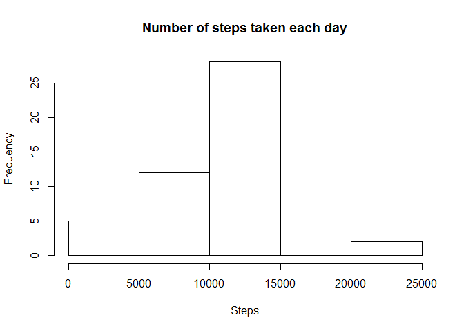
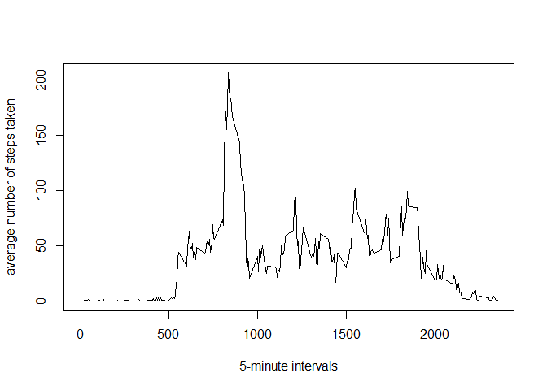
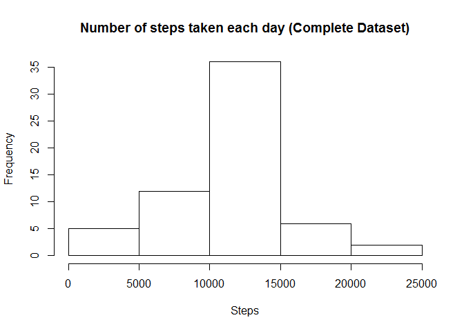

# Reproducible Research: Peer Assessment 1


## Loading and preprocessing the data

```r
activity<-read.csv(file = "activity.csv")
activity[,2]<-as.Date(activity[,2])
```

Calculate the total number of steps taken per day

```r
sumSteps<-aggregate(activity$steps, list(activity$date), sum)
colnames(sumSteps)<-c("Date", "Sum")
sumSteps
```

```
##          Date   Sum
## 1  2012-10-01    NA
## 2  2012-10-02   126
## 3  2012-10-03 11352
## 4  2012-10-04 12116
## 5  2012-10-05 13294
## 6  2012-10-06 15420
## 7  2012-10-07 11015
## 8  2012-10-08    NA
## 9  2012-10-09 12811
## 10 2012-10-10  9900
## 11 2012-10-11 10304
## 12 2012-10-12 17382
## 13 2012-10-13 12426
## 14 2012-10-14 15098
## 15 2012-10-15 10139
## 16 2012-10-16 15084
## 17 2012-10-17 13452
## 18 2012-10-18 10056
## 19 2012-10-19 11829
## 20 2012-10-20 10395
## 21 2012-10-21  8821
## 22 2012-10-22 13460
## 23 2012-10-23  8918
## 24 2012-10-24  8355
## 25 2012-10-25  2492
## 26 2012-10-26  6778
## 27 2012-10-27 10119
## 28 2012-10-28 11458
## 29 2012-10-29  5018
## 30 2012-10-30  9819
## 31 2012-10-31 15414
## 32 2012-11-01    NA
## 33 2012-11-02 10600
## 34 2012-11-03 10571
## 35 2012-11-04    NA
## 36 2012-11-05 10439
## 37 2012-11-06  8334
## 38 2012-11-07 12883
## 39 2012-11-08  3219
## 40 2012-11-09    NA
## 41 2012-11-10    NA
## 42 2012-11-11 12608
## 43 2012-11-12 10765
## 44 2012-11-13  7336
## 45 2012-11-14    NA
## 46 2012-11-15    41
## 47 2012-11-16  5441
## 48 2012-11-17 14339
## 49 2012-11-18 15110
## 50 2012-11-19  8841
## 51 2012-11-20  4472
## 52 2012-11-21 12787
## 53 2012-11-22 20427
## 54 2012-11-23 21194
## 55 2012-11-24 14478
## 56 2012-11-25 11834
## 57 2012-11-26 11162
## 58 2012-11-27 13646
## 59 2012-11-28 10183
## 60 2012-11-29  7047
## 61 2012-11-30    NA
```

Make a histogram of the total number of steps taken each day

```r
hist(sumSteps$Sum,
     main = "Number of steps taken each day",
     xlab = "Steps")
```

 

## What is mean total number of steps taken per day?

```r
meanSteps<-mean(sumSteps$Sum, na.rm = TRUE)
meanSteps
```

```
## [1] 10766.19
```

```r
medianSteps<-median(sumSteps$Sum, na.rm = TRUE)
medianSteps
```

```
## [1] 10765
```

## What is the average daily activity pattern?
Time series plot of the 5-minute interval (x-axis) and the average number of steps taken, averaged across all days (y-axis)

```r
#average the number of steps by interval
meanbyInterval<-aggregate(activity$steps, list(activity$interval), mean, na.rm=TRUE)
colnames(meanbyInterval)<-c("interval", "avgSteps")

#plot the timeseries graph
plot(x = meanbyInterval$interval,
     y = meanbyInterval$avgSteps,
     type = "l",
     ylab = "average number of steps taken",
     xlab = "5-minute intervals"
)
```

 

Report the max interval that contains the max number of steps

```r
#Interval that contains the maximum number of steps
meanbyInterval[which(meanbyInterval$avgSteps==max(meanbyInterval$avgSteps)),1]
```

```
## [1] 835
```

Calculate and report the total number of missing values in the dataset

```r
#get total number of rows with NA values
nrow(activity[is.na(activity$steps),])
```

```
## [1] 2304
```


## Imputing missing values
Replace the "NA"" step values in the dataset using the mean for that 5-minute interval across all days that we computed above. Create a new dataset that is equal to the original dataset but with the missing data filled in.

```r
#subset rows with NA values
rowsWithNASteps<-activity[is.na(activity$steps),]

#merge subset with meanbyInterval data frame, joined by interval
mergeByInterval<-merge(rowsWithNASteps, meanbyInterval, by = "interval")

#subset the avgSteps, date and interval into a new data frame
filledNARows<-mergeByInterval[,c("avgSteps","date", "interval")]

#rename avgSteps to #steps
colnames(filledNARows)[1]<-"steps"

#subset complate cases from activity data frame
completecasesActivity<-activity[complete.cases(activity),]

#rbind complete cases with filledNARows into a new complete dataset
completeDataSet<-rbind(completecasesActivity,filledNARows)

#sort the complete dataset by date, then by interval
completeDataSet<-completeDataSet[order(completeDataSet$date, completeDataSet$interval),]

#Calculate the total number of steps taken per day
sumCompleteSteps<-aggregate(completeDataSet$steps, list(completeDataSet$date), sum)
colnames(sumCompleteSteps)<-c("Date", "Sum")
```

Make a histogram of the total number of steps taken each day

```r
#Histogram of the total number of steps taken each day
hist(sumCompleteSteps$Sum,
     main = "Number of steps taken each day (Complete Dataset)",
     xlab = "Steps")
```

 

Calculate and report the NEW mean and median of the total number of steps taken per day using complete dataset.  
The new mean is the same as the old mean.  
The new median is less than the old median.

```r
meanCompleteSteps<-mean(sumCompleteSteps$Sum, na.rm = TRUE)
meanCompleteSteps
```

```
## [1] 10766.19
```

```r
medianCompleteSteps<-median(sumCompleteSteps$Sum, na.rm = TRUE)
medianCompleteSteps
```

```
## [1] 10766.19
```

## Are there differences in activity patterns between weekdays and weekends?
Create a new factor variable in the dataset with two levels -- "weekday" and "weekend" indicating whether a given date is a weekday or weekend day.  
Display a panel plot containing a time series plot (i.e. type = "l") of the 5-minute interval (x-axis) and the average number of steps taken, averaged across all weekday days or weekend days (y-axis). 

```r
#determine the day of each row
completeDataSet$day<-weekdays(completeDataSet$date)

#rename Sat & Sun to weekend, and the rest to weekday
completeDataSet[(completeDataSet$day == "Saturday"| completeDataSet$day == "Sunday"),4]<-"weekend"

completeDataSet[(completeDataSet$day == "Monday"|
                 completeDataSet$day == "Tuesday"|
                 completeDataSet$day == "Wednesday"|
                 completeDataSet$day == "Thursday"|
                 completeDataSet$day == "Friday"),4]<-"weekday"

completeDataSet<-transform(completeDataSet, day = factor(day))

## group data set by interval and day
library(dplyr)
```

```
## Warning: package 'dplyr' was built under R version 3.2.2
```

```
## 
## Attaching package: 'dplyr'
## 
## The following objects are masked from 'package:stats':
## 
##     filter, lag
## 
## The following objects are masked from 'package:base':
## 
##     intersect, setdiff, setequal, union
```

```r
grp_cols<-names(completeDataSet)[c(3,4)]
dots <- lapply(grp_cols, as.symbol)

meanbyIntervalDay<-completeDataSet %>%
    group_by_(.dots=dots) %>%
    summarise(steps = mean(steps))

#Make a panel plot containing a time series plot (i.e. type = "l") of the 5-minute interval (x-axis) and the #average number of steps taken, averaged across all weekday days or weekend days (y-axis).

library(lattice)

xyplot(steps ~ interval |day, 
       data = meanbyIntervalDay, 
       layout = c(1,2),
       type = "l",
       ylab = "Number of steps",
       xlab = "Interval"
       )
```

 

